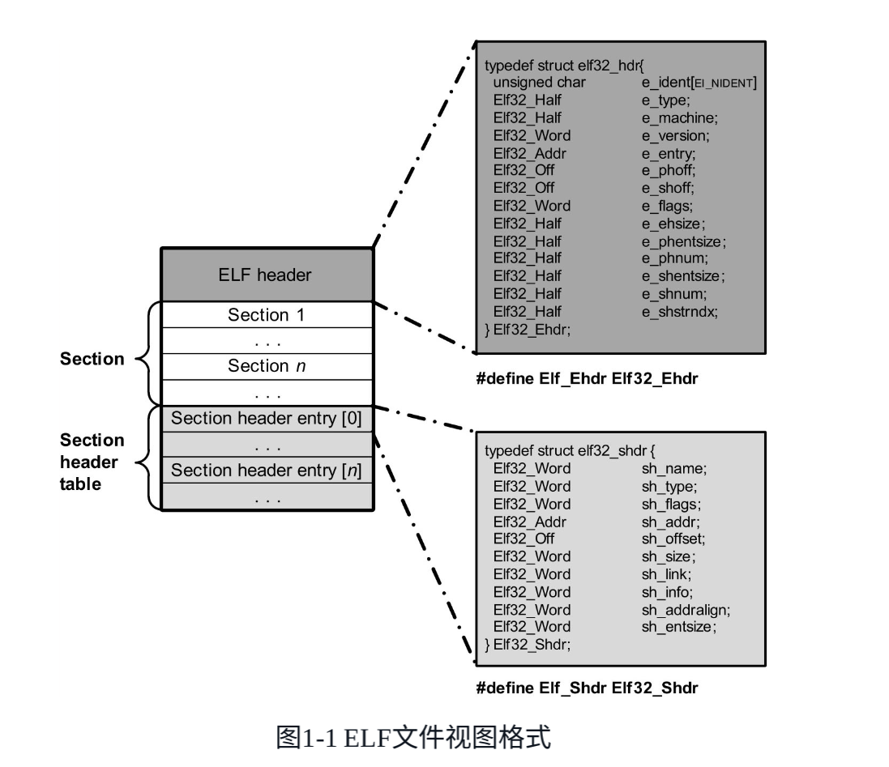

模块，其数据组织形式上是ELF格式的。主要包括ELF header, 若干sections和section header table. 


## 模块的加载过程
总的来说，加载模块时，例如使用insmod。其首先利用文件系统的接口将模块读取到用户空间中的一段内存中，然后通过系统调用`sys_init_module`让内核来处理模块加载的流程。

### sys_init_module
#### step1: 调用load_module加载模块
load_module会在内核中用vmalloc分配一块地址空间，然后将模块数据从用户空间copy到内核空间 （HDR视图）。  
load_module找到section名称字符串表和符号名称字符串表。  
遍历section hdr table中的所有entry，计算sh_addr.    
初始化struct module类型的遍历mod.  
sections会被分为两类：CORE和INIT，并为这两类section分配内存空间。  


#### step2: 加载后的处理
调用模块的初始化函数：mod中init函数指针指向模块源码中的初始化函数。  
初始化成功后释放不用的section （init, core)占用的内存，加载成功后释放HDR视图所占用的内存。

## 模块如何导出自身的函数/变量
> 通过宏EXPORT_SYMBOL、EXPORT_SYMBOL_GPL和EXPORT_SYMBOL_FUTURE。内核模块会把导出的符号分别放到“__ksymtab”​、​“__ksymtab_gpl”和“__ksymtab_gpl_future”section中。如果一个内核模块向外界导出了自己的符号，那么将由模块的编译工具链负责生成这些导出符号section，而且这些section都带有SHF_ALLOC标志，所以在模块加载过程中会被搬移到CORE section区域中。如果模块没有向外界导出任何符号，那么在模块的ELF文件中，将不会产生这些section。

内核需要管理模块导出的符号，使得其他模块能够使用这些符号。用find_symbol查找这些section在CORE中的位置，并记录在mod变量中。方便后续查找。

## 模块的参数传递
核心结构体struct kernel_param

## 模块依赖关系
两个链表：source_list和target_list
```cpp
<include/linux/module.h>
#ifdef CONFIG_MODULE_UNLOAD
    /* What modules depend on me? */
    struct list_head source_list;
    /* What modules do I depend on? */
    struct list_head target_list;
#endif
```

## 模块版本控制